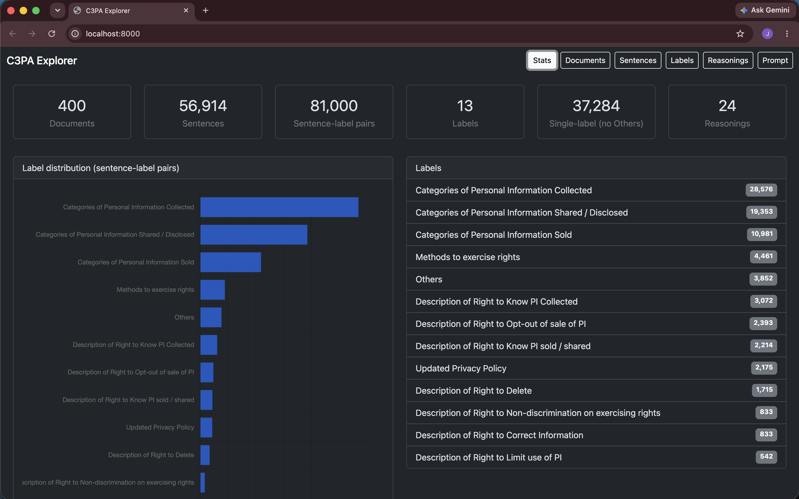

# qsbc — QSBC infrastructure for C3PA Privacy Policies

Infrastructure for the **Quantized Semantic Bottleneck Classifier (QSBC)**, an
interpretable sentence-classification architecture applied to the California
Privacy Rights Act (CPRA) subset of the
[C3PA privacy-policy dataset](https://github.com/MaazBinMusa/C3PA_Dataset).

Rather than mapping text directly to labels ($X \to Y$) with an uninterpretable
transformer, QSBC introduces a human-meaningful **semantic proposition
bottleneck** between input and prediction:

$$X \xrightarrow{\text{concept extraction}} \mathcal{C} \xrightarrow{\text{linear probe}} Y$$

Because the downstream head is strictly linear, the attribution of any concept
to any class logit is analytically exact. The full specification — concept
space formalism, quantization/gating ablations, the four-phase architecture,
and the diagnostic verification criteria — lives in the
[QSBC notebook](Quantized_Semantic_Bottleneck_Classifier_(QSBC)_for_C3PA_Privacy_Policies.ipynb).

This repository builds and operates the **Phases 1–2 data layer** of that
architecture, and the tooling to generate, store, and inspect its raw
material:

* A PostgreSQL database (Docker) of the parsed C3PA corpus (documents,
  sentences, labels) matching the reference split exactly.
* A chain-of-thought **`cot` agent** that generates atomic, generalized
  reasoning statements explaining each sentence→label assignment — the Phase 1
  "atomic rationale" source.
* A web explorer for browsing documents, sentences, labels, and generated
  reasonings.

## Reference baselines

Prior benchmarks on the exact single-label 12-class C3PA split (see
[C3PA_LR_vs_BERT_vs_FLAN_T5.ipynb](C3PA_LR_vs_BERT_vs_FLAN_T5.ipynb))
establish the QSBC comparison targets:

| Model | Validation Accuracy | Macro-F1 |
| ----- | ------------------: | --------: |
| TF-IDF + Logistic Regression | 0.7935 | 0.7161 |
| Fine-tuned BERT (`bert-base-uncased`) | 0.8208 | 0.7529 |
| Fine-tuned FLAN-T5 (`flan-t5-base`) | — | — |

## Mapping to the QSBC architecture

| QSBC phase | In this repo |
| ---------- | ------------ |
| **1. Atomic rationale generation** | The `cot` agent emits 2–5 generalized statements per `(sentence, label)`, stored raw + parsed in `reasonings` |
| **2. Alphabet induction & consolidation** | `reasonings.parsed` is the clustering input; the "unique reasoning statements" query below yields the corpus for HDBSCAN → concept alphabet |
| **3. Extraction** | Not yet implemented (retrieval engine / student transformer) |
| **4. Quantization & linear head** | Not yet implemented |

## Quick start

```bash
docker compose up -d --build          # Postgres 18 + app container (FastAPI + opencode + bun/node)
docker compose exec app bash scripts/load.sh   # import data/ TSVs into Postgres
```

The app container (`c3pa-app`) runs Python 3.14, FastAPI/uvicorn, and the
opencode CLI in one image. Credentials for the `opencode-go` provider are
mounted from `~/.local/share/opencode/auth.json` (read-only). The web UI is at
`http://localhost:8000`.

## Web viewer (FastAPI + Bootstrap SPA)

FastAPI + Bootstrap SPA exposes the parsed data (Stats, Documents, Sentences,
Labels, Reasonings, Prompt tabs, with search + pagination). Runs in the app
container — no host uvicorn needed.



API:
- `GET /api/stats`, `/api/labels`, `/api/documents?subset=&limit=&offset=`
- `GET /api/sentences?doc_id=&label_id=&label_mode=single|multi&q=&limit=&offset=`
- `GET /api/sentences/{id}` (includes labels + reasonings)
- `GET /api/reasonings?limit=&offset=`
- `POST /api/reasonings` — ingest an agent response `{sentence_id, label_id, run_id, model, raw_response}`; robustly extracts a JSON array of strings into `parsed` (status `ok`/`unparseable`, raw always preserved)
- `GET /api/prompt/random?label_id=&min_n=&max_n=&generalize=` — ready-to-paste prompt for a random single-label sentence
- `GET /api/prompt/{sentence_id}?label_id=&min_n=&max_n=&generalize=` — same, for a specific sentence

## Schema

| Table            | Purpose                                                                    |
| ---------------- | -------------------------------------------------------------------------- |
| `documents`      | One row per annotation CSV: `subset` (DB/WS), `doc_num`, `source_file`, `url` (best-effort from `Crawl/`) |
| `labels`         | The 13 CPRA labels (12 categories + `Others`)                              |
| `sentences`      | Sentences split from annotated passages, deduplicated per document         |
| `sentence_labels`| Junction table: a sentence can carry multiple labels (from multiple rows)  |
| `reasonings`     | Raw agent responses + extracted statements: `(sentence_id, label_id, run_id, model, raw_response, parsed jsonb, parse_status)` |

`v_single_label_sentences` is a view of sentences carrying exactly one label,
excluding `Others` — the 37,284-sentence corpus used by the reference
classification experiments.

## Pipeline notes (parity with the reference split)

- Document-level split identity is preserved via `doc_id` (e.g. `DB_1`, `WS_100`).
- Passages are segmented with `(?<=[.!?])\s+(?=[A-Z0-9])|\n+`, keeping sentences
  with ≥ 4 words. Literal `\n` escapes in source CSVs are **not** expanded, to
  exactly reproduce the reference counts (37,284 sentences / 399 docs).
- Duplicate `(sentence, label)` pairs from repeated annotation rows are collapsed.

## Chain-of-thought experiments

The prompt-input format is locked as JSON — `Sentence`, `Label`, and `Document`
(an array of every single-label sentence in the same document carrying the same
label, including the target). The `/api/prompt/*` endpoints assemble this
directly from the DB so an agent only has to receive and answer.

Agent responses are stored raw and parsed post-hoc; fences and preamble are
fine — `app/extract.py` recovers the JSON array (exact parse → fence strip →
balanced-bracket scan → regex), and unparseable rows are flagged, never dropped.

## Running batches

The `cot` agent (`.opencode/agents/cot.md`, `variant: low`, temp 0.05,
`"*": deny`) is invoked via the in-container opencode binary. Parse the dataset
on the host first (`python3 scripts/parse_c3pa.py`), then run a batch:

```bash
docker compose exec app python scripts/run_batch.py --per-label 24   # 288 runs, 4 workers
```

`run_batch.py` samples per-label via `/api/prompt/random`, runs the agent,
POSTs raw responses, and reports parse_status. `--label <id>` restricts to one
label, `--batch <run_id>` names the run (default `batch-<ts>`), `--dry-run`
samples without running.

Resilience policy (OpenCode Go subscription limits):
- `--max-retries 3` per job with exponential backoff (+jitter,
  `--backoff-base 5s` → `--backoff-max 60s`)
- throttle/quota detected from opencode stderr → backs off; `--stop-after-throttles 5`
  consecutive throttles auto-stops the batch
- `--max-errors 10` hard failures auto-stops
- duplicate inserts are ignored (HTTP 409), so a stopped batch can be resumed
  with the same `--batch` id

## Concept alphabet raw material

The unique reasoning statements across all agent runs are the Phase 2
clustering input (HDBSCAN → LLM consolidation → concept alphabet):

```sql
-- the "unique reasoning statements" analysis
SELECT jsonb_array_elements_text(parsed) AS statement, count(*)
FROM reasonings WHERE parse_status = 'ok'
GROUP BY 1 ORDER BY 2 DESC;
```